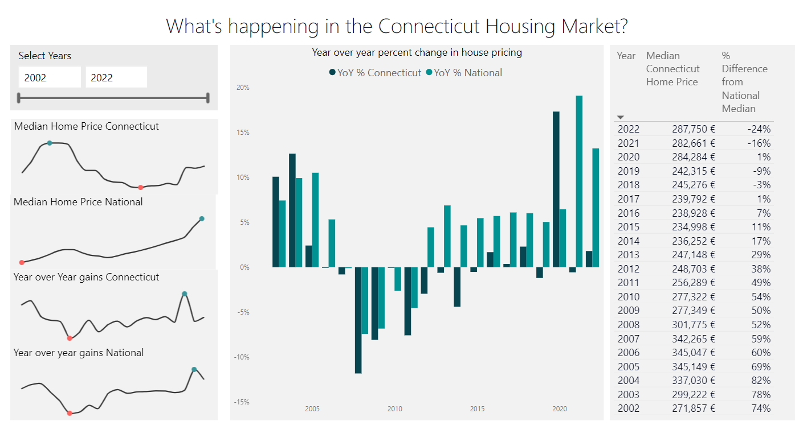

# MTT CoHack Challenge : Power BI

## Introduction

For this Power BI Co-Hack we are going to practice DAX time intelligence functions, looking at the housing market in the US state of Connecticut.

Time intelligence functions allow you to manipulate data over specific time periods like days, weeks, months, quarters, or years. Have you ever had someone ask you for the year-to-date value? Or how about year-over-year calculations? DAX makes working with dates and times easy!

**This is the report that you will need to build:**

## Requirements

- **Get data** from the Connecticut Housing Finance Authority using the following API endpoint: <https://data.ct.gov/resource/jpi8-zeza.json>
(hint: get data from web and pass in the API endpoint URL)
- **Get National data** to use as a comparison from: <https://dqydj.com/historical-home-prices/>
- **Create a date table** using DAX
  - Set your date table to begin in Jan of 2001 and end in Dec of 2020
- **Create relationships** between the Date column in your Date table and:
  - the Date column in your CT Housing Data table
  - the Date column in your National Housing Data table
- Using DAX to **create the following measures**:
  - Median sale price (hint: the source data already contains median by county and year, be careful!) for **Connecticut** and **National**
  - Year-over-year median sale price for **Connecticut** and **National**
  - Percent above/below national median home price
- **Create at least 2 visuals and a date slicer**
  - Column chart comparing YoY Median Housing Price Trend
  - Table containing Median Home Price and the Percent above/below national median home price
  - If you want to build an identical vizualization, add the sparklines comparing median home price and year-over-year gains.

## Learning Objectives

This hack will help you learn:

- Use Power BI Desktop and Power Query Editor to import data
- Set up a model with relationships
- Learn about DAX programming language
- Learn how to build a report with some visualizations

## Success Criteria

**Answer the following questions**:

- Which year did the housing market have the highest year-over-year gain in Connecticut?
- If you’re moving from within the US, when was the best time to buy a home in Connecticut? 😉

Did you come up with a compelling report that helps us answer these questions?

## Resources

This challenge uses data from two different websites – the Connecticut Housing Finance Authority’s [API Endpoint](https://data.ct.gov/resource/jpi8-zeza.json) and Don’t Quit Your Day Job’s Historical Home [Prices List](https://dqydj.com/historical-home-prices/). Use the web connector to get data from these two sites, and create your own Date table.

- [Download Power BI Desktop](https://aka.ms/pbidesktopstore)
- [Power BI Web Connector](https://learn.microsoft.com/en-us/power-query/connectors/web/web)
- [Create and manage relationships in Power BI Desktop](https://learn.microsoft.com/en-us/power-bi/transform-model/desktop-create-and-manage-relationships)
- [Learn DAX basics in Power BI Desktop](https://learn.microsoft.com/en-us/power-bi/transform-model/desktop-quickstart-learn-dax-basics)
- [Data Analysis Expressions (DAX) Reference](https://learn.microsoft.com/en-us/dax/)
- [Writing DAX with ChatGPT-4](https://www.youtube.com/watch?v=7Et1w7JqgYE)
- [Quick measure suggestions](https://learn.microsoft.com/en-us/power-bi/transform-model/quick-measure-suggestions)
- [Sparkline by OKViz](https://appsource.microsoft.com/en-us/product/power-bi-visuals/WA104380910?exp=kyyw&tab=Overview)

## Tips

Here's a tip on how the relationships should be created:

